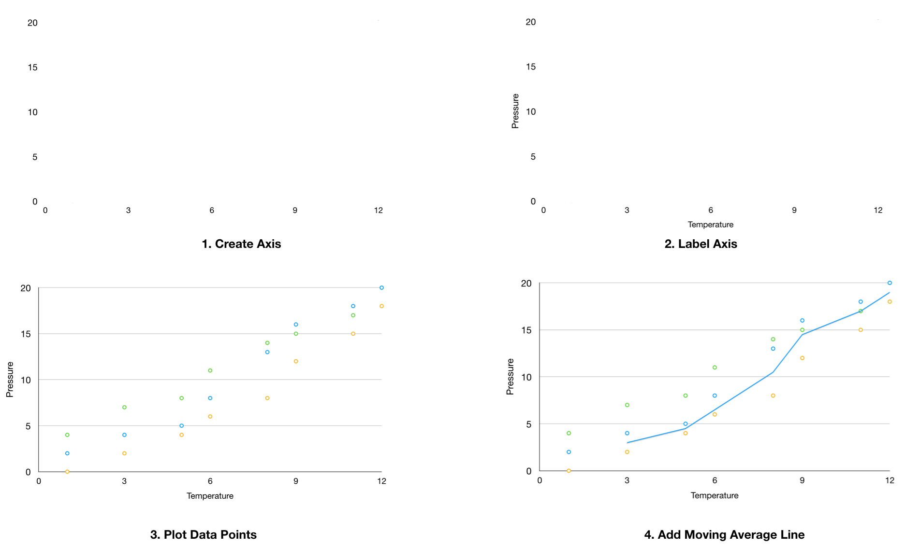

```{r global_options, include = FALSE}
knitr::opts_chunk$set(message=FALSE, 
tidy.opts=list(width.cutoff=60)) 
# `r knitr::knit_exit()`
```

\newpage
\hrule
# Introduction

\bigskip
The Road Accidents Data set contains over 250,000 observations from UK road accidents.
The data in its raw form isn't clean and to practice proper data hygiene, to avoid corrupted results,
the data needs to be cleaned before creating visualisations.
For this report, R will be used instead of Tableau as it provides more control over the data with its
powerful libraries.

R is a free and open source programming language for statistical computing and graphics, supported by 
the R Foundation.
It is widely used among statisticians and data miners for developing statistical software and 
for data analysis.
It has a vast array of libraries with powerful functions.
R also has its own markdown language, R Markdown (.rmd), which allows for creating documents explaining 
the process of data mining, cleaning, and creating visualisations with the results from running the 
R scripts. It supports the LaTeX format, which is used in the scientific community to create theses
and publishable scientific papers. 

This entire document is composed using the R Markdown language.
Hence, all code used to clean, prepare and filter the data, along with the code for creating the 
visualisations are included, where necessary, in this report. These code blocks can be recognised, as
they are syntax highlighted. The R Markdown for this document can be accessed on GitHub[1].

Any text output from running an R command will have a double hash prefix, for e.g. in R, the output
from a print command to print 'Hello World!' will be shown as follows:
\bigskip
```{r}
print("Hello World!")
```
\bigskip

The syntax highlighted statement is the R code, followed by its output on the next line with the double hash (##) prefix. Please note, a single hash prefix is an inline comment.

For this report, the \textbf{dplyr} package will be used for
data manipulation and the \textbf{ggplot2} package will be used to create the data visualisations.

The \textbf{dplyr} package is a very powerful package that is often used for data manipulation,
it can be used to connect to an external database which then allows the user to use the \textbf{dplyr} 
syntax for data manipulation instead of SQL. This is one of the most used tools by Data Scientists for 
data exploration as it allows for platform independent data manipulation.
In the case of this coursework, \textbf{dplyr} will be used on a data frame, which is created from the 
RoadData.csv file.

The \textbf{ggplot2} package follows the \textit{"grammar of graphics"} ethos, where layers are used to
bring visualisations to life. For e.g. following the \textit{"grammar of graphics"} ethos to generate 
a simple scatter plot, one would need to create an empty plot, with two axis, then add another layer 
which will contain the labels for the axis', followed by another layer, which contains the points for 
the data and another layer containing the line of best fit for the particular plot. Figure 1 shows 
the process of adding layers.



````{r echo=FALSE, message=FALSE}
library(dplyr)
library(ggplot2)
library(gridExtra)
```

\newpage
Let's begin by reading the data in from the csv file as a data frame:
\bigskip
```{r}
data <- read.csv(
  "/home/dthomas/Documents/KU/Advanced_Data_Modelling/private/RoadData.csv")
```
\bigskip
To get the accurate size of the data, print the number of observations (rows) and variables (columns):
\bigskip
```{r echo=TRUE}
nrow(data)
ncol(data)
```
\bigskip

So there are 285,331 observations and 70 variables.
This is an impressive amount of data and because of the large amount of variables, 
it's more efficient to clean the data on an as needed basis, i.e. just before feeding the data
to each visualisation.

Let's now see the date range of our data:
\bigskip
```{r echo=TRUE}
library(lubridate)

data %>% 
  mutate(date = dmy(date)) %>%
  summarise(min = min(date),
            max = max(date))
```
\bigskip

So we have data from the 1st of January 2015 till the 31st of December 2015.
This means all visualisations will only reflect trends and patterns of road accidents in 2015.


Please note that all visualisations from Figure 2 onwards are embedded into this PDF document as Scalable Vector Graphics
(SVG), so if a visualisation looks too small, one can zoom in without loosing image resolution.
But, this will also mean a high render time, so give the document a couple of seconds if rendering
takes a while when viewing the visualisations.


\newpage
\hrule
# Data Visualisations
\bigskip
## Number of Accidents vs Sex of Driver vs Age of Driver

\bigskip
### Aim
Motor-vehicle insurance companies often categorise men at a higher risk and age is also a factor that is
 taken into account. 
 
Are younger males more likely to be involved in a motor-vehicle accident compared to younger females?

To answer this question, we need all male and female driver ages, which can be obtained by filtering the
 data through \textbf{dplyr}.


\bigskip
### Data Preparation & Visualisation

* Remove -1 values from 'age_of_driver' column
\
* Retrieve data from 'age_of_driver' column where values equal 1 and assign it to a data frame
\
* Retrieve data from 'age_of_driver' column where values equal 2 and assign it to a data frame
\
* Create a data frame with two columns, age and sex, the latter being populated with 'Male' or 'Female' depending on the sex variable
\
* Combine the two data frames together to form a single data frame with male and female ages
\
* Create two histograms with respect to age, one for male and and another for female, and overlay the plots

\bigskip

```{r echo=FALSE}
# Retrieve male ages.
male_ages <- data %>% filter(sex_of_driver == 1) %>%
  select(age_of_driver)

# Filter out -1.
male_ages <- male_ages[male_ages > 0]

# Turn into data frame.
male_ages <- data.frame(male_ages, rep("Male", length(male_ages)))

# Assign column names.
colnames(male_ages) <- c("age", "sex")

# Retrieve female ages.
female_ages <- data %>% filter(sex_of_driver == 2) %>%
  select(age_of_driver)

# Filter out -1.
female_ages <- female_ages[female_ages > 0]

# Turn into data frame.
female_ages <- data.frame(female_ages, rep("Female", length(female_ages)))

# Assign column names.
colnames(female_ages) <- c("age", "sex")
```

```{r echo=FALSE}

# Combine male and female age data frames to a single data frame.
age_sex_df <- rbind(male_ages, female_ages)

# Load the Wes Anderson colour palette
require(wesanderson)

# Create the age vs sex vs No.of Accidents plot
plot_age_sex <- ggplot(age_sex_df, aes(x = age, colour = sex, fill = sex)) + 
  
  # Add labels for x , y & reference legend.
  labs(x = "Age of Driver", y = "No. of Accidents", colour = "Sex of Driver",
       fill = "Sex of Driver") +
  
  # Add custom colour palette
  scale_fill_manual(values = wes_palette("GrandBudapest1")) +
  scale_color_manual(values = wes_palette("GrandBudapest1")) +
  
  # Add the histogram layer
  geom_histogram(alpha=0.5, position = "identity") +
  
  # Use the classic theme to remove clutter
  theme_classic()
```

\newpage
```{r fig.cap="Driver Sex vs Driver Age vs No. of Accidents", echo=FALSE, fig.align='center',fig.height = 7, fig.width = 9}
grid.arrange(plot_age_sex)
```

As you can see from Figure 2, there were more male driver accidents than female driver accidents, 
where younger drivers are more likely to be involved in an accident irrespective of sex.
But, it is important to know that the conclusion from the visualisation 
doesn't take into account how many male and female drivers there are in the UK. So if there are more 
male drivers than female drivers,
statistically speaking, a higher proportion of accidents can be linked to male drivers.


\newpage
## Geo-spatial plot of accidents

\bigskip
### Aim
Are accidents more likely to occur in densely populated areas such as city centres?
To answer this question, a Geo-spatial plot is required, with a density heat-map using the longitude
and latitude data.

\bigskip
### Data Preparation & Visualisation

For this visualisation, we only need the longitude and latitude data.
Now, longitude and latitude data is likely to have large amounts of variation, 
so, it is futile to try and obtain unique values and look for outliers.
However, \textbf{ggplot2} has built in pattern
recognition for this case, which will automatically omit evident outliers.
This means we can proceed straight to creating the visualisation.
\

* Obtain the UK Map layout, and fill it with colour
\
* Add a layer plotting all accidents on the map as points using 'longitude' & 'latitude' data
\
* Adjust the density 'alpha' attribute so areas with a higher amount of accidents are brighter
\
* Add a heatmap density layer to better visualise hotspot density
\
* Obtain the top 9 populous cities in the UK and add them as labels to the Geo-plot, to see if there is a correlation.

\bigskip

```{r echo=FALSE}
# Load the required libraries
library(maps)
library(mapproj)
library(RColorBrewer)
library(ggrepel)

# Obtain the UK map
UK <- map_data("world", "UK")

# Obtain all UK cities data, this includes the population for each city.
UK_cities <- world.cities %>% filter(country.etc == "UK")

# Create the geo_plot
plot_geo_uk <- ggplot(data = UK, aes(x = long, y = lat, group = group)) + 
  
  # Add the empty UK map
  geom_polygon(fill = "azure2") +
  coord_map() +
  theme_void() +
  
  # Plot the accidents on the UK map.
  geom_point(aes(longitude, latitude), data = data, col = "darkorchid1",
             alpha = 0.025, size = 1e-1, inherit.aes = FALSE) +
  
  
  # Add another layer for the density heatmap:
  stat_density2d(aes(longitude, latitude, fill = ..level..),
                 data = data,
                 geom = "polygon",
             inherit.aes = FALSE) +
  labs(fill = "Accident Density") +
  scale_fill_gradientn(colours = rev(brewer.pal(8, "RdPu"))) + 
  
  
  # Retrieve top 9 UK Cities, sorted by population density,
  # and add them as labels.
  geom_label_repel(data=UK_cities %>% arrange(pop) %>%
                     tail(9), aes(x=long, y=lat, label=name),
                     size=5, inherit.aes = FALSE, box.padding = 2.1,
                   max.iter = 50000, nudge_y = 1.25, nudge_x = 0.15) +
  geom_point( data=UK_cities%>% arrange(pop) %>% 
                    tail(9), aes(x=long, y=lat), color="black",
                    size=1, inherit.aes = FALSE)
```
```{r fig.cap="Geospatial plot of accidents", fig.height = 12, fig.width = 6, echo=FALSE, warning= FALSE}
plot_geo_uk
```

\newpage
Looking at the Geo-spatial plot, we can easily see that major UK cities have more accidents than the UK 
countryside, this can be due to the areas being more densely populated, which means more vehicles and
people, which in-turn increases the risk of an accident.

\bigskip
\bigskip
## Districts with the highest number of accidents

\bigskip
### Aim
What were the top 20 accident prone districts?

Were there particular districts where the number of accidents exceeded over the other districts?
To answer this question, the local authority district IDs needs to be obtained.
But let's also make this plot a bit more useful, where the proportion of accident severity is also
shown. For this visualisation, it should be a combination of a Word Cloud and a bar plot.

\bigskip
### Data Preparation & Visualisation

* Obtain district IDs from the 'local_authority_.district.' column
\
* Create a data frame with the frequency of each unique 'local_authority_.district.' variable
\
* Sort the data frame by descending order, so the most frequent local districts are at the top
\
* Retrieve the top 20 districts from the data frame
\
* Substitute the values for each district ID with its corresponding value from the data dictionary
\
* Create the word cloud
\
* Create the stacked bar plot by adding a bar layer and specifying the fill value to accident severity

\bigskip

```{r echo=FALSE}
# Get district ids with their occurence count;
# i.e. district id + how many times it occurs
districts <- as.data.frame(
  sort(table(data$local_authority_.district.),
       decreasing = TRUE))

# Assign column names
colnames(districts)[1] <- "id"

# Get the top 20 district ids with the highest number of accidents
districts <- districts[1:20,]

# To assign a String value instead of an integer ID
districts$id <- toupper(districts$id)
```

```{r echo=FALSE}
# Substitute district names
districts$id[districts$id == 300] <- "Birmingham"
districts$id[districts$id == 204] <- "Leeds"
districts$id[districts$id == 1] <- "Westminster"
districts$id[districts$id == 200] <- "Bradford"
districts$id[districts$id == 596] <- "Cornwall"
districts$id[districts$id == 926] <- "Glasgow City"
districts$id[districts$id == 91] <- "Liverpool"
districts$id[districts$id == 215] <- "Sheffield"
districts$id[districts$id == 635] <- "Wiltshire"
districts$id[districts$id == 9] <- "Lambeth"

districts$id[districts$id == 30] <- "Barnet"
districts$id[districts$id == 923] <- "Edinburgh, City of"
districts$id[districts$id == 5] <- "Tower Hamlets"
districts$id[districts$id == 27] <- "Ealing"
districts$id[districts$id == 203] <- "Kirklees"
districts$id[districts$id == 346] <- "Nottingham"
districts$id[districts$id == 211] <- "Doncaster"
districts$id[districts$id == 601] <- "Bristol, City of"
districts$id[districts$id == 10] <- "Wandsworth"
districts$id[districts$id == 169] <- "County Durham"
```

```{r echo=FALSE}
# Load the word cloud library
library(ggwordcloud)

# To get the same visualisation.
set.seed(21)
# Create the word cloud
plot_word_cloud <- ggplot(districts, 
                          aes(label = id,
                              size = Freq,
                              color = id, replace = TRUE)) +
  
  # Add the word cloud layer
  geom_text_wordcloud_area() +
  scale_size_area(max_size = 16) +
  
  # Add colours from the Wes Anderson palette
  scale_color_manual(values = c(rev(wes_palette("GrandBudapest1")),
                               wes_palette("Moonrise2"),
                               wes_palette("Darjeeling1"),
                               wes_palette("FantasticFox1"),
                               wes_palette("Rushmore1")[3:5])) +
  # Minimal theme to avoid clutter
  theme_minimal()

```

```{r echo=FALSE}

# Create a data frame with the frequency of each district
ld <- as.data.frame(
  sort(table(data$local_authority_.district.),
       decreasing = TRUE))

# Assign column names
colnames(ld)[1] <- "id"

# Retrieve the top 20 districts
ld <- ld[1:20,]

# Filter districts with only accident severity in the range 1 - 3
districts <- data %>%
  filter(accident_severity %in% c(1,2,3)) %>%
  select(accident_severity, local_authority_.district.) %>%
  filter(local_authority_.district. %in% ld$id)

# Add column names
colnames(districts)[1] <- "severity"
colnames(districts)[2] <- "id"

# Substitute district names from the data dictionary
districts$id[districts$id == 300] <- "Birmingham"
districts$id[districts$id == 204] <- "Leeds"
districts$id[districts$id == 1] <- "Westminster"
districts$id[districts$id == 200] <- "Bradford"
districts$id[districts$id == 596] <- "Cornwall"
districts$id[districts$id == 926] <- "Glasgow City"
districts$id[districts$id == 91] <- "Liverpool"
districts$id[districts$id == 215] <- "Sheffield"
districts$id[districts$id == 635] <- "Wiltshire"
districts$id[districts$id == 9] <- "Lambeth"

districts$id[districts$id == 30] <- "Barnet"
districts$id[districts$id == 923] <- "Edinburgh, City of"
districts$id[districts$id == 5] <- "Tower Hamlets"
districts$id[districts$id == 27] <- "Ealing"
districts$id[districts$id == 203] <- "Kirklees"
districts$id[districts$id == 346] <- "Nottingham"
districts$id[districts$id == 211] <- "Doncaster"
districts$id[districts$id == 601] <- "Bristol, City of"
districts$id[districts$id == 10] <- "Wandsworth"
districts$id[districts$id == 169] <- "County Durham"

# Substitute accident severity values from the data dictionary
districts$severity[districts$severity == 1] <- "Fatal"
districts$severity[districts$severity == 2] <- "Serious"
districts$severity[districts$severity == 3] <- "Slight"
```

```{r echo=FALSE}
# Load the forcats library to use the built in frequency function
require(forcats)

# Create bar plot
plot_bar_districts <- ggplot(districts, 
                              aes(x = fct_rev(fct_infreq(id)),
                                  fill = as.factor(severity))) +
  # Add the bar plot layer
  geom_bar() +
  
  # Add labels for x & y axis, along with labels for the reference legend
  labs(x = "Local District", y = "No. of Accidents",
       fill = "Accident Severity") +
  
  # Add colours from the Wes Anderson palette
  scale_fill_manual(values = 
                      rev(c(wes_palette("Royal2")[3],
                        wes_palette("Royal2")[5],
                        wes_palette("Darjeeling1")[1]))) +
  
  # Flip the vertical bar plot to a horizontal bar plot
  coord_flip() +
  
  # Add the classic theme
  theme_classic()
```

```{r, fig.cap="Most accident prone districts with accident severity", echo = FALSE, fig.align='center',fig.height = 12, fig.width = 6}
grid.arrange(plot_word_cloud, plot_bar_districts)
```

\newpage

As you can see Birmingham had the highest number of accidents compared to any other local district.
But why isn't London at the top? Well that's because London is a Metropolis, made up of several local districts.

\bigskip
\bigskip
## Weather and Light conditions

\bigskip
### Aim
In what weather and light conditions are accidents more likely to occur?
Are accidents more likely to occur during night than day? How does weather impact the number of 
accidents?

\bigskip
### Data Preparation & Visualisation

For this visualisation, two density plots are best suited, one for Weather vs No. of Accidents,
and another for Light Conditions vs No. of Accidents.

A density plot is quite simple, where peaks correlate to the number of values, or how 'dense' the data
 is for that particular value.
 
* Retrieve 'weather_conditions'
  * Filter out any values outside 1 - 7
  * Substitute values from the Data Dictionary
\
* Retrieve 'light_conditions'
  * Filter out any values outside 1 - 6
  * Substitute values from the Data Dictionary
\
* Create the weather conditions vs accident density plot by adding a density layer with colour set to weather conditions
\
* Create the light conditions vs accident density plot by adding a density layer with colour set to light conditions

\bigskip

```{r echo = FALSE}
conditions <- c(1:7)

# Retrieve weather and light data
weather_data <- data %>% select(weather_conditions, light_conditions) %>%
  filter(weather_conditions %in% conditions) %>%
  filter(light_conditions %in% conditions[1:6])

# Substitute values
weather_data$weather_conditions[weather_data$weather_conditions == 1] <-
  "Fine"
weather_data$weather_conditions[weather_data$weather_conditions == 2] <-
  "Raining no high winds"
weather_data$weather_conditions[weather_data$weather_conditions == 3] <- 
  "Snowing no high winds"
weather_data$weather_conditions[weather_data$weather_conditions == 4] <- 
  "Fine but high winds"
weather_data$weather_conditions[weather_data$weather_conditions == 5] <- 
  "Raining and high winds"
weather_data$weather_conditions[weather_data$weather_conditions == 6] <- 
  "Snowing and high winds"
weather_data$weather_conditions[weather_data$weather_conditions == 7] <- 
  "Fog or mist"
```

```{r echo =FALSE}
# Create weather vs accident density plot
plot_weather <- ggplot(weather_data, aes(weather_conditions)) +
  
  # Add the density layer
  geom_density(aes(fill = factor(weather_conditions)), alpha = 0.8) +
  
  # Add the labels for the y axis and for the reference legend
  labs(y = "Accidents", fill = "Weather Conditions") +
  
  # Add colours from the Wes Anderson palette
  scale_fill_manual(values = c(rev(wes_palette("GrandBudapest1")),
                               wes_palette("Moonrise2"),
                               wes_palette("Darjeeling1"),
                               wes_palette("FantasticFox1"),
                               wes_palette("Rushmore1")[3:5])) +
  
  # Add the classic theme
  theme_classic() +
  
  # Remove all x axis legends as they aren't necesarry in this case;
  # we are only interested in the peaks.
  theme(axis.title.x=element_blank(),
        axis.text.x=element_blank(),
        axis.ticks.x=element_blank())
```

```{r echo=FALSE}

# Substitute values from the data dictionary
weather_data$light_conditions[weather_data$light_conditions == 1] <-
  "Daylight"
weather_data$light_conditions[weather_data$light_conditions == 4] <- 
  "Darkness - lights lit"
weather_data$light_conditions[weather_data$light_conditions == 5] <- 
  "Darkness - with lights unlit"
weather_data$light_conditions[weather_data$light_conditions == 6] <- 
  "Darkness - no lighting"
```

```{r echo=FALSE}
# Create the light vs accident density plot
plot_light <- ggplot(weather_data, aes(light_conditions)) +
  
  # Add the density plot layer
  geom_density(aes(fill = factor(light_conditions)), alpha = 0.8) +
  
  # Add y and reference legend labels
  labs(y = "Accidents", fill = "Light Conditions") +
  
  # Add colours from the Wes Anderson palette
  scale_fill_manual(values = wes_palette("GrandBudapest2")) +
  theme_classic() +
  
  # Remove all x axis values
  theme(axis.title.x=element_blank(),
        axis.text.x=element_blank(),
        axis.ticks.x=element_blank())
```
\bigskip
```{r, fig.cap="Effect of Weather and Light Conditions", echo = FALSE, fig.align='center',fig.height = 8, fig.width = 8}
grid.arrange(plot_weather, plot_light)
```

\newpage
From Figure 5, we can see that most accidents occured during fair weather.
Light conditions does seem to have an effect, as the majority of accidents occured during night time 
with street lights on.

\bigskip
\bigskip
## Weekday and Time vs No. of Accidents

\bigskip
### Aim

Is there a correlation between the number of accidents with weekday and time?
This will tell us which weekday and time pose a higher risk to road vehicles.
It will also tell us if there is a particular weekday with more accidents than any other.

\bigskip
### Data Preparation & Visualisation

For the weekday plot:

* Substitute weekday ID  in the 'day_of_week' column with corresponding values from the Data Dictionary
\
* Create the weekday bar plot by taking the frequency of each week into account.
\
* Arrange the bars in descending order
\
* Retrieve the time data from the 'time' column
\
* Convert time data to POSIX time
\
* Create the time density plot by adding a density layer with the POSIX time data

\bigskip

```{r echo=FALSE, warning=FALSE}
data$day_of_week[data$day_of_week == 1] <- "Sunday"
data$day_of_week[data$day_of_week == 2] <- "Monday"
data$day_of_week[data$day_of_week == 3] <- "Tuesday"
data$day_of_week[data$day_of_week == 4] <- "Wednesday"
data$day_of_week[data$day_of_week == 5] <- "Thursday"
data$day_of_week[data$day_of_week == 6] <- "Friday"
data$day_of_week[data$day_of_week == 7] <- "Saturday"

require(forcats)
require(wesanderson)

# Create the weekday plot
plot_days <- ggplot(data, aes(x = fct_rev(fct_infreq(day_of_week)),
                              fill = day_of_week)) +
  
  # Add the histogram layer
  geom_histogram(stat = "count", width = 0.7) + 
  
  # Add y and x axis labels
  labs(y = "No. of Accidents", x = "Weekday") +
  
  # Flip the plot, so it's a horizontal bar plot.
  coord_flip() +
  theme_classic() +
  
  # Add colours from the Wes Anderson palette
  scale_fill_manual(values = c(rev(wes_palette("GrandBudapest1")),
                               wes_palette("GrandBudapest1"))) +
  
  # Remove reference legend, as each bar is labelled at the Y axis
  theme(legend.position = "none")
```

```{r echo=FALSE}
# Retrieve the time data
times <- data %>% select(accident_index, time)

# Convert time to POSIX time variables
times$time <- as.POSIXct(times$time, format="%H:%M:%S")

# Remove NA values
times <- na.omit(times)
```

```{r echo=FALSE}

# Create the time plot
plot_time <- ggplot(times, aes(x = time, fill = "lightcoral"))  +
  
  # Add the density layer
  geom_density() +
  
  # Add the x axis labels in the 12 hour format with AM/PM suffix
  scale_x_datetime(date_breaks = "4 hour",
                       date_labels = "%I:%M %p") +
  
  # Add x and y axis labels
  labs(x = "Time", y = "Density") +
  theme_classic() +
  
  # Remove the reference leged, as it's not needed for a single variable, time.
  theme(legend.position = "none")

```

\bigskip
```{r fig.cap="Weekdays vs No. of Accidents and Time vs No. of Accidents", echo = FALSE, fig.align='center',fig.height = 6, fig.width = 6}
require(gridExtra)
grid.arrange(plot_days, plot_time)
```

\newpage

From Figure 6, we can conclude that Friday had the most number of accidents followed by
Thursday. Time also had an effect, where the highest peak was around the evening rush, 5 - 6pm, followed
by the second highest peak during the morning  rush 8 - 10am.

\bigskip
\bigskip
## Seasonality with Journey Purpose and the deadliest days of the year

\bigskip
### Aim

Is there a seasonality to the frequency of accidents and what journey purpose accounted for the majority
of accidents? Also, what was the deadliest day of the year, i.e. which day had the most accidents?

\bigskip
### Data Preparation & Visualisation

For this plot a line graph would be best along with a bar plot for the deadliest days.

* Retrieve data from the 'journey_purpose_of_driver' & 'date' columns where journey purpose values are in the range 1 - 5.
\
* Convert the date values to month name abbreviations.
\
* Create a data frame with the frequency of each month
\
* Substitute journey purpose ID with its corresponding value in the Data Dictionary
\
* Create the seasonality plot with months on the X axis and No. of Accidents on the Y axis.
\
* For the deadliest day plot, first retrieve the dates from the 'date' column
\
* Convert the date values to date objects
\
* Create a data frame with the frequency of each date.
\
* Sort the data frame in descending order, so the dates with the highest frequency is at the top.
\
* Retrieve the top 6 dates.
\
* Create the bar plot for the top 6 deadliest dates.

\bigskip
```{r echo=FALSE}
# Load the required packages
require(lubridate) 

# Retrieve the journey purpose and date columns, 
# where the journey purpose values are in the range 1 - 5.
journey_purpose_date <- data %>% select(journey_purpose_of_driver, date) %>%
  filter(journey_purpose_of_driver %in% c(1,2,3,4,5))

# Convert date values to Month abbreviations, for e.g.:
# 23/01/2015 will be "Jan"
journey_purpose_date$date <- 
  month.abb[month(as.POSIXlt(journey_purpose_date$date, format="%d/%m/%Y"))]

# Create a data frame with Month vs Frequency
table_jd <- as.data.frame(table(journey_purpose_date))

# Convert all journey purpose IDs to upper case,
# so they're converted from numeric to string values.
table_jd$journey_purpose_of_driver <- 
  toupper(table_jd$journey_purpose_of_driver)

# Substitute ID with corresponding values from the data dictionary
table_jd$journey_purpose_of_driver[table_jd$journey_purpose_of_driver 
                                   == 1] <- "Journey as part of work"
table_jd$journey_purpose_of_driver[table_jd$journey_purpose_of_driver 
                                   == 2] <- "Commuting to/from work"
table_jd$journey_purpose_of_driver[table_jd$journey_purpose_of_driver 
                                   == 3] <- "Taking pupil to/from school"
table_jd$journey_purpose_of_driver[table_jd$journey_purpose_of_driver 
                                   == 4] <- "Pupil riding to/from school"
table_jd$journey_purpose_of_driver[table_jd$journey_purpose_of_driver 
                                   == 5] <- "Other"
```

```{r echo=FALSE}
# Create the month plot
plot_month <- ggplot(table_jd, aes(factor(date, levels = month.abb), Freq,
                     colour = journey_purpose_of_driver,
                     group = journey_purpose_of_driver)) + 
  
  # Add the line plot layer
  geom_line() +
  
  # Label x & y axis, along with the legend reference
  labs(x = "Month", y = "No. of Accidents", 
       colour = "Journey Purpose of Driver") +
 
  # Add colours from the Wes Anderson palette 
  scale_color_manual(
    values = c(rev(wes_palette("Darjeeling1")), wes_palette("GrandBudapest1")))

```

```{r echo=FALSE}
# Retrieve dates
td <- data %>% select(date)

# Turn date values into Date objects
td$date <- as.Date(td$date, format = "%d/%m/%Y")

# Store as a data frame
td <- as.data.frame(table(td))

# Arrange the date frame in descending order,
# so the dates with the highest number of accidents are at the top.
td <- td %>% arrange(desc(Freq))

# Get the top 6 dates
td <- td[1:6,]
```

```{r echo=FALSE}
# Create the date plot
plot_date <- 
  ggplot(td, aes(x = reorder(td, -Freq), Freq, fill = as.factor(td))) +
  
  # Add the bar plot layer
  geom_bar(stat="identity") +
  
  # Add colours from the Wes Anderson palette
  scale_fill_manual(values = c(wes_palette("GrandBudapest1"),
                               rev(wes_palette("GrandBudapest1")))) +
  
  # Add x & y axis labels
  labs(x = "Date", y = "No. of Accidents") +
  theme_classic() +

  # Remove reference legends as each bar is labelled
  theme(legend.position = "none") 
```

\bigskip
```{r fig.cap="Seasonality and Journey Purpose of drivers with the top 6 deadliest days of 2015", echo = FALSE, fig.align='center',fig.height = 10, fig.width = 8}
require(gridExtra)
grid.arrange(plot_month, plot_date)
```
\bigskip

\newpage
Figure 7 shows 'Journey as part of work' had the highest number of accidents with clear seasonal peaks
around September and January, when schools open and right after the New Year holiday. The second bar 
plot shows that the deadliest day of 2015 was the 10th of February, followed by the 11th of May.


\bigskip
\bigskip
## Road Types, Road Class, Speed Limits and Roads with the highest number of fatalities

\bigskip
### Aim

On what type of roads are accidents more likely to occur? Does speed limit have an effect on the number
of accidents? And on which road in the UK did the most amount of fatal accidents occur?

To answer these questions, a unique dashboard is in order. Where two doughnut charts will present the
data for speed limits and its proportion of accidents and road classes with its proportion of accidents.

This can be followed by two vertical bar graphs, one displaying the top 5 deadliest roads in the UK,
and another displaying the top 5 road types with the highest number of accidents in the UK.

\bigskip
### Data Preparation & Visualisation

For the first doughnut chart, speed limits and its proportion of accidents:

* Retrieve speed limits
\
* Filter out values 0 and 10
\
* Create a data frame with the frequency of each speed limit
\
* Calculate the fractions for each speed limit with respect to the sum of frequencies
\
* Calculate the cumulative sum for each frequency and assign it to each speed limit
\
* Calculate each cumulative sum's neighbouring value, this is so ggplot knows where a value starts and ends.
\
* Create the doughnut plot
\
* Assign the percentage value for each speed limit to the reference legend labels

For the second doughnut chart, road class and its proportion of accidents:

* Retrieve road class values
\
* Filter out all values that equals 6
\
* Substitute each road class ID with its corresponding value from the Data Dictionary
\
* Create a data frame with each road class and its frequency
\
* Calculate the fractions for each road class with respect to the sum of frequencies
\
* Calculate the cumulative sum for each frequency and assign it to each road class
\
* Calculate each cumulative sum's neighbouring value, this is so ggplot knows where a value starts and ends.
\
* Create the doughnut plot
\

For the third plot, a bar graph, representing the top 5 roads in the UK with the most fatalities:

* Paste road class and road numbers together to obtain road names
\
* Create a data frame with the frequencies of each road name
\
* Arrange the data frame in descending order, so the road names with the most fatalities are at the top
\
* Retrieve the top 5 road names with the most fatalities
\
* Create the bar plot

For the fourth plot, a bar graph, road types with the highest number of accidents:

* Retrieve the road type data
\
* Filter out values -1 and 9
\
* Substitute road type IDs with their corresponding values in the Data Dictionary
\
* Create the bar plot


\bigskip
```{r echo=FALSE}
# Retrieve speed limits,
# but filter out 0 and 10.
speed <- data %>% 
  filter(speed_limit != 0 & speed_limit !=10) %>% select(speed_limit)

# Get the frequency of occurence for each speed limit.
speed <- as.data.frame(table(speed))

# Calculate the fraction for each speed limit i.e.
# the proportion of each speed with respect to the entire range.
speed$fraction <- speed$Freq / sum(speed$Freq)

# Calculate the cumulative sum of the fractions.
speed$ymax = cumsum(speed$fraction)

# Calculate the minimum excluding the 1st value.
# The 1st value is assigned 0.
speed$ymin = c(0, head(speed$ymax, n = -1))
```

```{r echo=FALSE}

# Create the speed limit plot
plot_speed <- 
  ggplot(speed, aes(ymax=ymax, ymin=ymin, xmax=4, xmin=3, fill=speed)) +
  
  # Add a rectangle layer ( This will later become a circle)
  geom_rect() +
  
  # Turn the rectangles into a circle with proportions
  coord_polar(theta="y") + 
  
  # Turn the circle into a doughnut
  xlim(c(1, 4)) +
  
  # Add colours from the Wes Anderson palette
  scale_fill_manual(
    values = c(wes_palette("Royal2"), rev(wes_palette("Royal1"))),
    # Add labels for the legend reference displaying the percentage.
    labels = paste(speed$speed, "mph -",
                   round(speed$Freq/sum(speed$Freq)*100,
                         digits = 2), "%")) +
  
  # Add legend title label
  labs(fill = "Speed Limit") +
  theme_void() +
  
  # Set font size
  theme(text = element_text(size=20),
        legend.position = "left")
```

```{r echo=FALSE}
# Retrieve the road class,
# but filter out data where the value is 6.
road_class <- data %>% select(X1st_road_class) %>%
  filter(X1st_road_class != 6)

# Convert values from numeric to string so they can be compared.
road_class$X1st_road_class <- toupper(road_class$X1st_road_class)

# Substitute each value,
# with its corresponding value from the data dictionary.
road_class$X1st_road_class[road_class$X1st_road_class == 1] <- "Motorway"
road_class$X1st_road_class[road_class$X1st_road_class == 2] <- "A(M)"
road_class$X1st_road_class[road_class$X1st_road_class == 3] <- "A"
road_class$X1st_road_class[road_class$X1st_road_class == 4] <- "B"
road_class$X1st_road_class[road_class$X1st_road_class == 5] <- "C"

# Convert the data to each unique road class with its frequency.
road_class <- road_class %>% select(X1st_road_class)
road_class <- as.data.frame(table(road_class))

# Calculate the fraction for each road class
road_class$fraction <- road_class$Freq / sum(road_class$Freq)

# Calculate the cumulative sum of fractions
road_class$ymax = cumsum(road_class$fraction)

# Calculate the minimum excluding the 1st value.
# The 1st value is assigned 0.
road_class$ymin = c(0, head(road_class$ymax, n = -1))
```

```{r echo=FALSE}
# Create the road class plot
plot_road_class <- 
  ggplot(road_class,
         aes(ymax=ymax, ymin=ymin, xmax=4, xmin=3, fill=road_class)) +
  
  # Create rectangles
  geom_rect() +
  
  # Convert the rectangles to a circle with proportions
  coord_polar(theta="y") +
  
  # Turn the circle into a doughnut
  xlim(c(1, 4)) +
  
  # Add legend title label
  labs(fill = "Road Class") +
  theme_void() +
  
  # Add colours from the Wes Anderson colour palette
  scale_fill_manual(
    values = c((wes_palette("GrandBudapest1")), wes_palette("GrandBudapest2")),
    # Add labels for the legend reference displaying the percentage.
    labels = paste(road_class$road_class, "-",
                   round(road_class$Freq/sum(road_class$Freq)*100,
                         digits=2), "%")) +
  # Set font size 
  theme(text = element_text(size=20),
        legend.position = "right")
```

```{r echo=FALSE}
# Retrieve the road type data,
# where values -1 and 9 are filtered out.
road_type <- data %>% select(road_type) %>%
  filter(road_type != -1 & road_type != 9)

# Convert road type from numeric to string for comparison.
road_type$road_type <- toupper(road_type$road_type)

# Substitute road type IDs with its corresponding values
# from the Data Dictionary.
road_type$road_type[road_type$road_type == 1] <- "Roundabout"
road_type$road_type[road_type$road_type == 2] <- "One way street"
road_type$road_type[road_type$road_type == 3] <- "Dual carriageway"
road_type$road_type[road_type$road_type == 6] <- "Single carriageway"
road_type$road_type[road_type$road_type == 7] <- "Slip road"
road_type$road_type[road_type$road_type == 12] <- "One way street/Slip road"
```

```{r echo=FALSE}
# Create the road type plot
plot_road_type <- 
  ggplot(road_type, aes(x=fct_infreq(road_type), fill = road_type)) +
  
  # Add a bar plot layer
  geom_bar() +
  # Add colours from the Wes Anderson palette
  scale_fill_manual(values = c(wes_palette("GrandBudapest1"),
                               rev(wes_palette("GrandBudapest1")))) +
  
  # Add the number of accidents to the top of each bar
  geom_text(stat="count",aes(label=..count..), vjust = -0.2, size = 5) +
  
  # Add x & y axis labels
  labs(x = "Road Type", y = "No. of Accidents") +
  theme_classic() +
  
  # Set font size
  theme(text = element_text(size=20),
        # Angle the x axis names
        axis.text.x = element_text(angle = -40, hjust = 0)) +
  
  # Remove reference legends
  theme(legend.position = "None")
```

```{r echo=FALSE}
# Retrieve road numbers, road class and accident severity
road_number <- data %>%
  select(X1st_road_class, X1st_road_number, accident_severity) %>%
  filter(accident_severity == 1 & X1st_road_number != 0)

# Substitute the road class IDs with its corresponding values
# from the Data Dictionary
road_number$X1st_road_class[road_number$X1st_road_class == 1] <- "M"
road_number$X1st_road_class[road_number$X1st_road_class == 2] <- "A(M)"
road_number$X1st_road_class[road_number$X1st_road_class == 3] <- "A"
road_number$X1st_road_class[road_number$X1st_road_class == 4] <- "B"
road_number$X1st_road_class[road_number$X1st_road_class == 5] <- "C"
 
# Paste the road road class and the road numbers together.
# for e.g. A & 304 will become A304.
road_number$road_name <- 
  paste(road_number$X1st_road_class, road_number$X1st_road_number, sep="")

# Calculate the frequency of each road
road_number <- as.data.frame(table(road_number$road_name))

# Arrange them in descending order
road_number <- road_number %>% arrange(desc(Freq))

# Retrieve the top 5 deadliest roads (with the most fatal accidents).
road_number <- road_number[1:5,]
```

```{r echo=FALSE}
# Create the plot for most fatal accidents in a road
plot_road_name <- 
  ggplot(road_number, aes(x = reorder(Var1, -Freq), y = Freq, fill = Var1)) +
  
  # Add bar plot
  geom_bar(stat = "identity") +
  
  # Add colours from the Wes Anderson palette
  scale_fill_manual(
    values = c(wes_palette("GrandBudapest1"),
               wes_palette("GrandBudapest1"))) +
  
  # Add the number of accidents on top of each bar
  geom_text(aes(label=Freq), vjust=-0.2, size = 5) +
  
  # Add x & y axis labels
  labs(x = "Road Name", y = "No. of Fatal Accidents") +
  theme_classic() +
  
  # Set font size
  theme(text = element_text(size = 20),
        # Angle the X axis names
        axis.text.x = element_text(angle=-40, hjust=0)) +
  
  # Remove reference legends
  theme(legend.position = "None")
```

\bigskip
```{r fig.cap="Proportion of accidents to Speed Limit, Road Class and Road Type with the top 5 fatal roads", echo = FALSE, fig.align='center',fig.height = 14, fig.width = 13}
require(gridExtra)
grid.arrange(plot_speed, plot_road_class, plot_road_name, plot_road_type, ncol=2)
```

\newpage

From Figure 8, we can conclude that accidents are more likely to occur in 30mph zones.
'A' roads in the UK accounted for the highest number of accidents and single carriageways have the highest 
number of accidents.

Finally, the road with the most fatalities was the M40.

\bigskip
\bigskip
## Vehicle Manoeuvre

\bigskip
### Aim

What vehicle manoeuvre caused the most amount of accidents?

A good way to represent this information is through a tree map.

\bigskip
### Data Preparation & Visualisation

* Retrieve the vehicle manoeuvre data
\
* Filter out -1 values
\
* Create a data frame with the frequency of each vehicle manoeuvre
\
* Arrange the data in descending order
\
* Retrieve the top 10 manoeuvres
\
* Substitute each vehicle manoeuvre ID with its corresponding value in the Data Dictionary
\
* Create the tree map

\bigskip
```{r echo=FALSE}
# Load the treemap package into memory
library(treemap)

# Retrieve the vehicle manoeuvre data,
# filter out -1 values.
manoeuvre <- data %>% select(vehicle_manoeuvre) %>%
  filter(vehicle_manoeuvre != -1)

# Create a data frame with the frequency of each manoeuvre
manoeuvre <- as.data.frame(table(manoeuvre))

# Arrange the data in descending order
manoeuvre <- manoeuvre %>% arrange(desc(Freq))

# Retrieve the top 10 manoeuvres
manoeuvre <- manoeuvre[1:10,]

# Convert numeric to string for comparison
manoeuvre$manoeuvre <- toupper(manoeuvre$manoeuvre)

# Substitute manoeuvre IDs with their corresponding values,
# in the Data Dictionary
manoeuvre$manoeuvre[manoeuvre$manoeuvre == 18] <- 
  "Going ahead other"
manoeuvre$manoeuvre[manoeuvre$manoeuvre == 9] <- 
  "Turning right"
manoeuvre$manoeuvre[manoeuvre$manoeuvre == 4] <- 
  "Slowing or stopping"
manoeuvre$manoeuvre[manoeuvre$manoeuvre == 3] <- 
  "Waiting to go - held up"
manoeuvre$manoeuvre[manoeuvre$manoeuvre == 5] <- 
  "Moving off"
manoeuvre$manoeuvre[manoeuvre$manoeuvre == 17] <- 
  "Going ahead right-hand bend"
manoeuvre$manoeuvre[manoeuvre$manoeuvre == 2] <- 
  "Parked"
manoeuvre$manoeuvre[manoeuvre$manoeuvre == 16] <- 
  "Going ahead left-hand bend"
manoeuvre$manoeuvre[manoeuvre$manoeuvre == 7] <- 
  "Turning left"
manoeuvre$manoeuvre[manoeuvre$manoeuvre == 13] <- 
  "Overtaking moving vehicle - offside"

# Add the frequency values to each manoeuvre description
manoeuvre$manoeuvre <- 
  paste(manoeuvre$manoeuvre, manoeuvre$Freq, sep = "\n")
```

```{r echo=FALSE, fig.cap="Vehicle Manoeuvres vs No. of Accidents", fig.align='center',fig.height = 10, fig.width = 9}
# Create the tree map
treemap(manoeuvre, 
        # Supply the manoeuvre variable as the index
        index = "manoeuvre",
        # The size of each box will depend on the frequency attribute
        vSize = "Freq",
        # Add colours from the Wes Anderson palette
        palette = 
          c(rev(wes_palette("GrandBudapest2")),
            rev(wes_palette("Royal2")[3:5])),
        # Set the title
        title = "Vehicle Manoeuvre",
        type = "index")
```
\bigskip

\newpage
From Figure 9, we can clearly see that 'Going ahead other' caused the highest number of accidents.
Interestingly, turning right seems to be a hazardous manoeuvre.

\bigskip
\bigskip
## Hierarchical clustering of Vehicle Types with Propulsion Codes and Accident Severity

\bigskip
### Aim

Can we see unique clusters of vehicle types? How similar are these vehicle types with each other?
This information is very useful to build a hierarchy of clusters.

\bigskip
### Data Preparation & Visualisation

For this visualisation, a dendrogram is best suited.

A dendrogram is a tree-structured graph used in heat maps to visualise the result of a hierarchical
clustering calculation.

The dendrogram lists the objects which are clustered along the x-axis, and the distance at which the 
cluster was formed along the y-axis.

Distances along the x-axis are not particularly meaningful in a dendrogram; the observations are often 
equally spaced to make the dendrogram easier to read.

The result of a clustering is presented either as the distance or the similarity between the clustered 
rows or columns depending on the selected distance measure.


The steps for this visualisation is better explained with the R code.

* First, let's retrieve the vehicle type, propulsion code & accident severity data and filter out -1 values from both vehicle type and propulsion code.

\bigskip
```{r, echo=TRUE}
# Retrieve vehicle type and propulsion code,
# filter out -1 values from both columns.
d <- data %>% 
  select(vehicle_type, propulsion_code, accident_severity) %>%
  filter(vehicle_type != -1 & propulsion_code != -1)

# Let's see the top 6 rows of the data:
head(d)
```

\bigskip
* Now, let's extract all unique variables from 'vehicle_type'.

\bigskip
```{r echo = TRUE}
# Retrieve all unique vehicle types
d1 <- data.frame(unique(d$vehicle_type))

# Let's see the top 6 rows:
head(d1)
```
\bigskip
* Now create a data frame with vehicle type as the row name, with propulsion codes and accident severity codes as columns.
\
* Then assign the frequency of each propulsion code for each vehicle type.
\
* Then assign the frequency of each accident severity for each vehicle type

\bigskip
```{r echo=TRUE}
# Convert the vehicle type column values to row names instead
d1 <- d1[,-1]
rownames(d1) <- unique(d$vehicle_type)

# Retrieve all unique vehicle types for the upcoming for-loop
vehicle_types <- c(unique(d$vehicle_type))

# All unique propulsion codes for the upcoming for-loop
p_codes <- c(unique(d$propulsion_code))

# All unique accident severity values for the upcoming for-loop
a_severity <- c(unique(d$accident_severity))

# Populate with frequency of propulsion code for each vehicle_type
# and accident severity frequency
for(vehicle_type in vehicle_types)
{
  for(p_code in p_codes)
  {
    p <- 
      as.data.frame(
        table(d$vehicle_type[d$vehicle_type == vehicle_type 
                             & d$propulsion_code == p_code]))
    
    p <- p$Freq
    
    if(length(p) < 1)
    {
      p <- 0
    }
    
    p_code <- paste("p", p_code, sep = "")
    
    d1[[p_code]][rownames(d1) == vehicle_type] <- p
  }
  
  for(severity in a_severity)
  {
    s <- as.data.frame(
      table(d$vehicle_type[d$vehicle_type == vehicle_type
                           & d$accident_severity == severity]))
    
    s <- s$Freq
    
    if(length(s) < 1)
    {
      s <- 0
    }
    
    s_code <- paste("s", severity, sep="")
    
    d1[[s_code]][rownames(d1) == vehicle_type] <- s
  }
}#

# Let's take a peek at the data:
head(d1)
```
\bigskip
* And finally substitute each vehicle type ID with its corresponding value from the Data Dictionary.

\bigskip
```{r}
# Substitute vehicle type IDs with their corresponding values
# from the Data Dictionary
rownames(d1)[rownames(d1) == 1] <- "Pedal cycle"
rownames(d1)[rownames(d1) == 2] <- "Motorcycle <= 50cc"
rownames(d1)[rownames(d1) == 3] <- "Motorcycle <= 125cc"
rownames(d1)[rownames(d1) == 4] <- "Motorcycle 125cc - 500cc"
rownames(d1)[rownames(d1) == 5] <- "Motorcycle > 500cc"
rownames(d1)[rownames(d1) == 8] <- "Taxi/Private hire"
rownames(d1)[rownames(d1) == 9] <- "Car"
rownames(d1)[rownames(d1) == 10] <- "Minibus"
rownames(d1)[rownames(d1) == 11] <- "Bus or coach"
rownames(d1)[rownames(d1) == 16] <- "Ridden horse"
rownames(d1)[rownames(d1) == 17] <- "Agricultural Vehicle"
rownames(d1)[rownames(d1) == 18] <- "Tram"
rownames(d1)[rownames(d1) == 19] <- "Van / Goods <=3.5t"
rownames(d1)[rownames(d1) == 20] <- "Goods > 3.5t & < 7.5t"
rownames(d1)[rownames(d1) == 21] <- "Goods >= 7.5t"
rownames(d1)[rownames(d1) == 22] <- "Mobility scooter"
rownames(d1)[rownames(d1) == 23] <- "Electric motorcycle"
rownames(d1)[rownames(d1) == 90] <- "Other vehicle"
rownames(d1)[rownames(d1) == 97] <- "Motorcycle - unknown cc"
rownames(d1)[rownames(d1) == 98] <- "Goods - unknown mgw"

# Let's take a peek at the data:
head(d1)
```
\bigskip
* Create the dendrogram

\bigskip
```{r warning=FALSE}
# Load the dendextend package for customising the dendrogram 
library(dendextend)

# Scale the values, this is a data normalisation step.
d1 <- scale(d1)

# Create the dendrogram by calculating the Euclidean distance
# between each row's propulsion codes and accident severity codes.
d1 %>%
  dist() %>%
  hclust %>%
  as.dendrogram() -> dend

# Customise the dendrogram by giving it nodes and
# adding colours from the Wes Anderson colour palette.v
dend <- dend %>% 
  set("labels_cex",1.2) %>% 
  set("leaves_pch", 19) %>%
  set("leaves_cex", 0.8) %>%
  set("leaves_col",
      value = c(wes_palette("GrandBudapest1"),
                              wes_palette("Darjeeling1")[1],
                              rep(wes_palette("Darjeeling1")[2], 7),
                              wes_palette("Darjeeling1")[3:5],
                              wes_palette("GrandBudapest2"))) %>%
  set("labels_col",
      value = c(wes_palette("GrandBudapest1"),
                wes_palette("Darjeeling1"),
                wes_palette("GrandBudapest2")), k=11) %>%
  set("branches_k_color", value = c(wes_palette("GrandBudapest1"),
                                    wes_palette("Darjeeling1"),
                                    wes_palette("GrandBudapest2")), k=11)
```

```{r fig.cap="Hierarchical clustering of Vehicle Types", echo = FALSE, fig.align='center',fig.height = 15, fig.width = 12}
par(cex=1.3, mar = c(11,2,4,0))
plot(dend)
```

\newpage

We can observe 11 major clusters with large variances with each other.
How different a cluster is shown with each node's height and not by their widths.

So in this instance, Motorcycles over 500cc and Motorcycles less than or equal to 125cc are in the same
cluster group. From there, there is a parent cluster, where Motorcycles over 500cc and Motorcycles less
than or equal to 125cc is the first group, and Goods Vehicles over or equal to 7.5 tonnes is the other
group in this parent cluster.

This process is repeated for each cluster until you reach the top, where every node is part of the 
entire cluster.

There are some very interesting observations here, cars and taxis are in totally different clusters.
Another interesting observation is how similar Goods Vehicles over 7.5 tonnes are to motorcycles over 
500cc, there is a common saying motorcyclists and large goods vehicles are a dangerous combination, 
and with relation to accident severity, the dendrogram does seem to add evidence to this saying.


\newpage
## Using Machine Learning to compute variable importance in accidents

\bigskip
### Aim

How important are the following variables in determining an accident and its severity?

* Age of Driver
\
* Vehicle Type
\
* Age of Vehicle
\
* Day of Week
\
* Weather Conditions
\
* Road Surface Conditions
\
* Light Conditions
\
* Sex of Driver
\
* Speed Limit
\
* Engine Capacity


\bigskip
### Data Preparation & Visualisation

The best way to calculate a variable's importance in this dataset is to use Machine Learning.

We can create a model using the Random Forest algorithm that predicts an accident's severity, fatal, 
serious or slight, from the variables mentioned above.

So we'd need to train the model with the data, and test the model's accuracy.
We'd need to achieve above 80% accuracy in classifying the accident severity from the aforementioned 
variables. As a general rule of thumb, 70% accuracy is the minimum threshold, but let's aim a bit higher
with 80% to achieve reliable results.

Once we've trained and created the model, we can then see what variables are the most important for
making our predictions, and create a horizontal bar plot from it.

For this visualisation, data preparation steps with the R code will be easier to understand:

* First extract the aforementioned variables from the data and filter them:

\bigskip

```{r}
# Read data
data <- read.csv(
  "/home/dthomas/Documents/KU/Advanced_Data_Modelling/private/RoadData.csv")

# Load dplyr
library(dplyr)

# Extract and filter data
accident_ml <- data %>%
  
  select(accident_severity,
         age_of_driver, vehicle_type, age_of_vehicle,
         day_of_week, weather_conditions, road_surface_conditions,
         light_conditions, sex_of_driver, speed_limit,
         engine_capacity_.cc.) %>%
# Filter values for accident severity  
  filter(accident_severity %in% c(1,2,3)) %>%
  
# Filter out null values
  filter(vehicle_type != -1 
         & age_of_driver != -1 
         & age_of_vehicle != -1 & road_surface_conditions != -1
         & sex_of_driver != -1 & engine_capacity_.cc. != -1)

# Now let's count the number of rows after filtering:
nrow(accident_ml)
```

\bigskip
* From here we need to normalise age of driver and age of vehicle using log transformation, this is because there is a possibility for ages to have large variances.

\bigskip
```{r}
# Normalise data using log transformation.
accident_ml$age_of_driver = log(accident_ml$age_of_driver)
accident_ml$age_of_vehicle = log(accident_ml$age_of_vehicle)
```
\bigskip
* Now we can move onto machine learning, create a data partition of 60:40, 60% of the data will be used for training the model, and 40% of the data will be used for testing and evaluating the accuracy of the model.

\bigskip
```{r}
# Load library for Machine Learning
library(caret)

# Create data partition for training and testing 60:40 split
train_row_numbers <- createDataPartition(accident_ml$accident_severity,
                                         p = 0.6, list=FALSE)

# Partition data
train <- accident_ml[train_row_numbers,]
test <- accident_ml[-train_row_numbers,]
```

\bigskip
* Let's start training the model using 'ranger', a Random Forest model that utilises all available CPU cores for training.

\bigskip
```{r eval=FALSE}
# Train the model, 
# this will take approximately 36.6 minutes on a Ryzen 8 core CPU.

# Create a Random Forest model, as it best suits this scenario.
# Start training.
model_rf = train(as.factor(accident_severity) ~ .,
                 data = train,
                 importance = "permutation",
                 method = "ranger")

# Save the model to disk for later usage.
saveRDS(model_rf, "./model_rf.rds")
```

\bigskip
* Let's evaluate the model's accuracy in predicting accident severity.

\bigskip
```{r echo=FALSE}
# Load the model from disk.
model_rf <- readRDS("model_rf.rds")

# Let's look at the test accuracy
predictions <- predict(model_rf, test)

# Print the Confusion Matrix.
confusionMatrix(predictions, as.factor(test$accident_severity))
```

\bigskip
* We are seeing over 93% accuracy in classifying accident severity
\
* Now let's obtain and store the variable importance from our model

\bigskip
```{r}
# Let's obtain and store variable_importance as a variable
variable_importance <- varImp(model_rf)
```
\bigskip
* The variable importance is in percentages, so all we need to do now is plot the data.

\bigskip
```{r echo=FALSE}
require(ggplot2)
require(gridExtra)
require(wesanderson)

variable_importance <- data.frame(c("Age of Driver", "Vehicle Type", "Age of Vehicle", "Weekday", "Weather Conditions", " Road Surface Conditions", "Light Conditions", "Sex of Driver", "Speed Limit", "Engine Size"),
                                  c(86.83, 41.35, 62.78, 66.42, 19.40, 33.13,  38.76, 29.98,  87.13, 100.00))

# Assign column names
colnames(variable_importance)[1] <- "Variable"
colnames(variable_importance)[2] <- "Importance"

plot_variable_importance <- ggplot(variable_importance, aes(x = reorder(Variable, Importance), y = Importance, fill = Variable)) +
  geom_bar(stat = "identity") + 
  geom_text(stat = "identity", aes(label= paste(Importance, "%", sep="")), hjust=-0.1) +
  labs(x = "Variable", y = "% of Importance ") +
  coord_flip() +
  scale_fill_manual(values = c(rev(wes_palette("GrandBudapest1")),
                               wes_palette("GrandBudapest2"), wes_palette("Moonrise3"))) +
  theme_classic() +
  theme(legend.position = "None",
        text = element_text(size = 15))
    
# Load Skimr library
#library(skimr)

# See train data values
#skim(train)
```

```{r fig.cap="Importance of a variable for accidents", echo = FALSE, fig.align='center',fig.height = 10, fig.width = 12}
plot_variable_importance
```


\newpage
From this data, we can clearly see that Engine Size, Speed Limit and Age of Driver were the three highest
deciding factors for an accident and its severity for the year 2015. The least important factor was
weather conditions with an importance value of 19.4%.


\newpage
\hrule
# Conclusion

This coursework was probably the most interesting coursework out of the entire Computer Science course.
And while it was time consuming, it definitely was the most fun and enjoyable coursework to date.

The decision to use R instead of Tableau was a good idea at first, but it slowly turned out to be more
daunting than imagined, partly because of only having an intermediate level knowledge, of R.

However, from the third visualisation on-wards, things started to ease, as familiarity with R started to 
take place. This was the turning point where the true power of R was revealed.

If a person comes from a strong programming background, then R is one of the best alternatives to 
Tableau.

R is often used for data analysis and exploration, but Python can also be used. Usually in the industry,
Python is used for creating production code, while R is used to connect to databases for data analysis,
and for creating powerful graphical visualisations.

R is a very mature programming language, which means there are many ways to do a single task.
This often becomes a barrier when learning R, and it's not just with R, this trend can be seen with
older and more mature programming languages such as Perl and Lisp.

In total, it took 36 hours to create this document.

One of the major advantages of using R over Tableau is that it gives more room for automation, as R is a
programming language.
It also has a vast array of powerful libraries which will allow anyone to create powerful and complex graphs that 
normally would be difficult to create using other Graphical User Interface (GUI) based tools.

When working in the industry, companies will often have their own unique colour palette that they will
want to use for presentations. Now Tableau does support custom colour palettes, but it's more
complicated than it should be, and when it comes to creating complex graphics, such as dendrograms,
Tableau has its limitations.

For the visualisations in this document, colours from the Wes Anderson colour palette were used.
The \textbf{ggplot2} package truly did shine through this coursework. The customisation options are 
endless with it.

Using the \textbf{dplyr} package to clean, filter and transform the data was very intuitive, and this allowed for 
more complex transformations with ease, such as normalising age data using log transformation.

On a cautionary note, which is quite relevant to Data Science in general is data validity.
For e.g. during the proofread of this document, some values looked a bit odd, and upon investigation,
an error in the data transformation task was found. So mistakes can easily be made which could have
dire consequences for companies that rely on this information.

Upon reflection, perhaps more complex insights could have been obtained if more time was spent on this
coursework. One major problem was with explaining the steps taken to produce the visualisations,
as when translating it from code to words, the document become larger than required; a surplus
of 32 pages which totalled to 67 pages! Hence, a decision was made to link the R-markdown file for 
this document as a reference that can be accesed online through GitHub.


In conclusion, doing this coursework in R has become a worthwhile investment, as the skills learnt in R 
through this coursework greatly impressed all Data Scientists at a recent interview for a graduate 
Data Science job.

\newpage
\hrule
# References

[1] Thomas, D., 2020. Dominthomas/Roadaccidents_2015. [online] GitHub - Domin Thomas. 
    Available at: *https://github.com/dominthomas/RoadAccidents_2015/blob/master/CI6320_Data_Analysis_2_K1651915.Rmd* [Accessed 23 March 2020].


